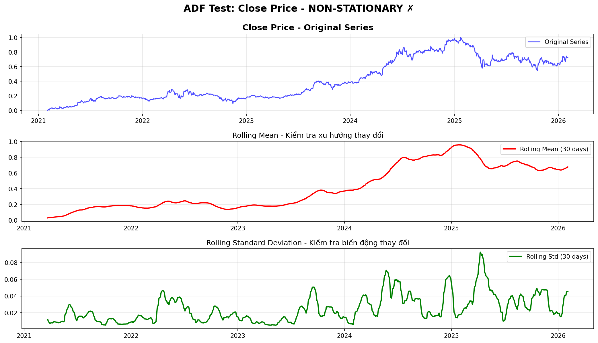
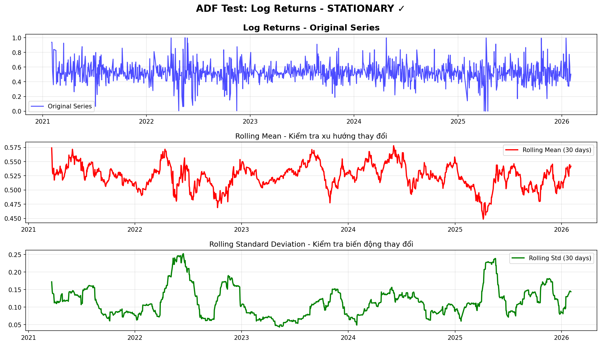
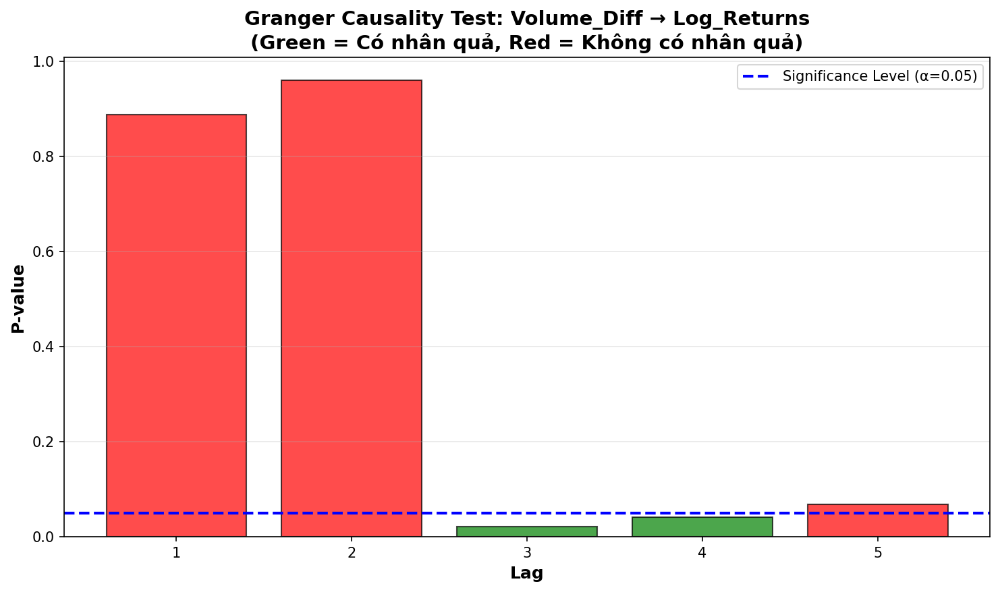
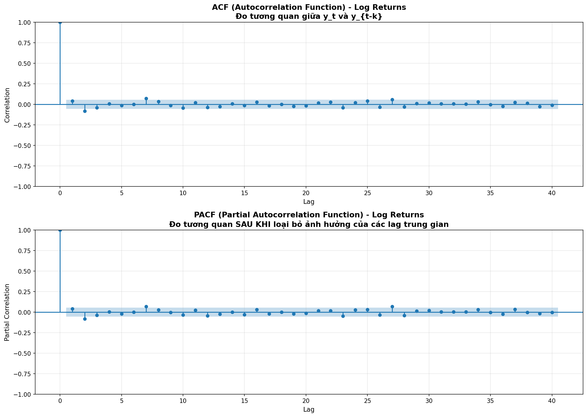
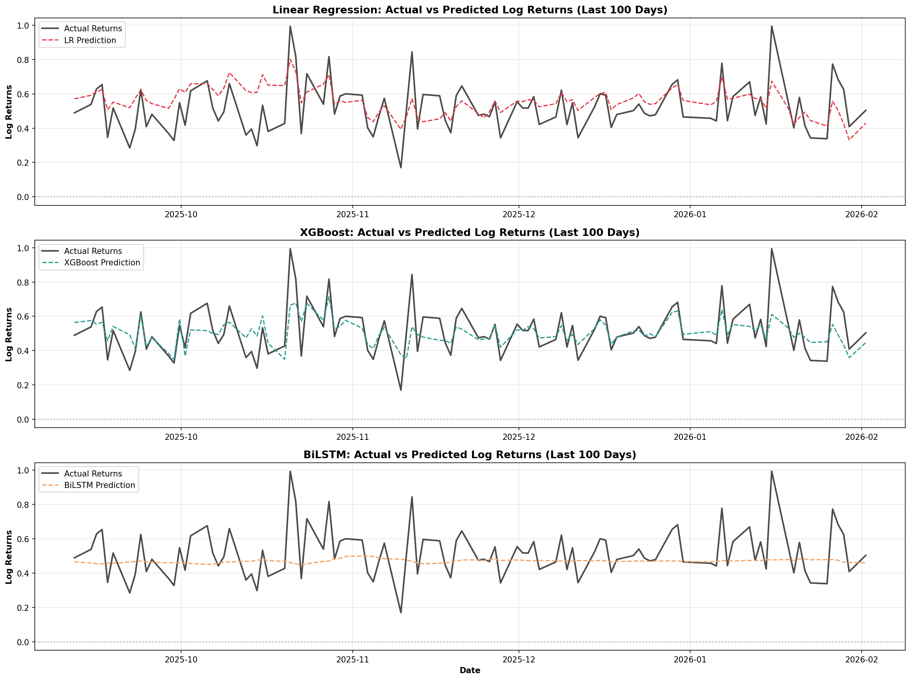
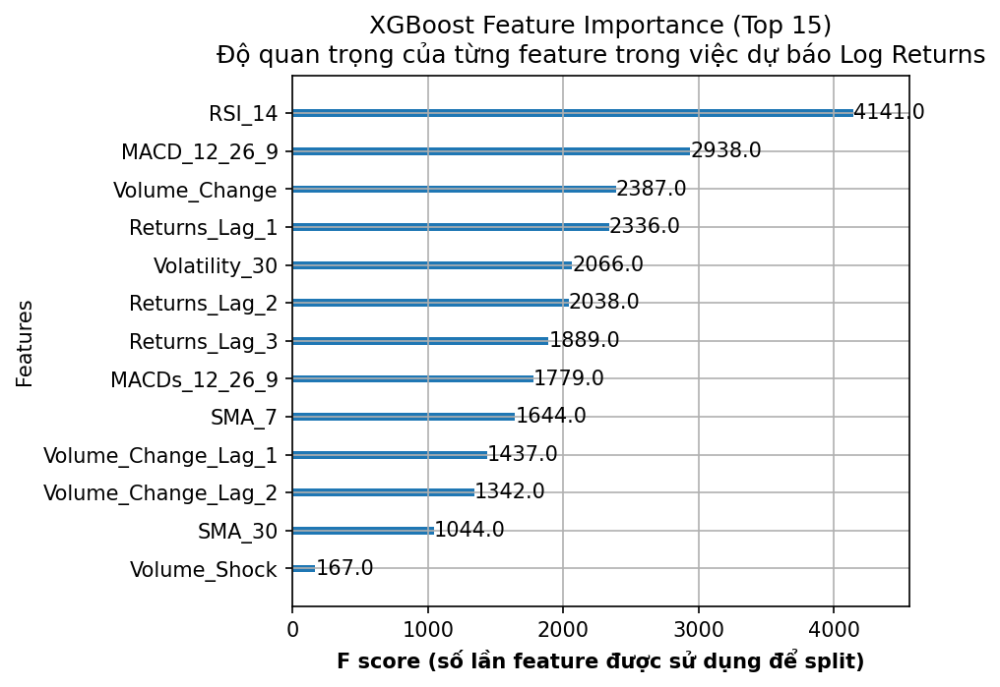
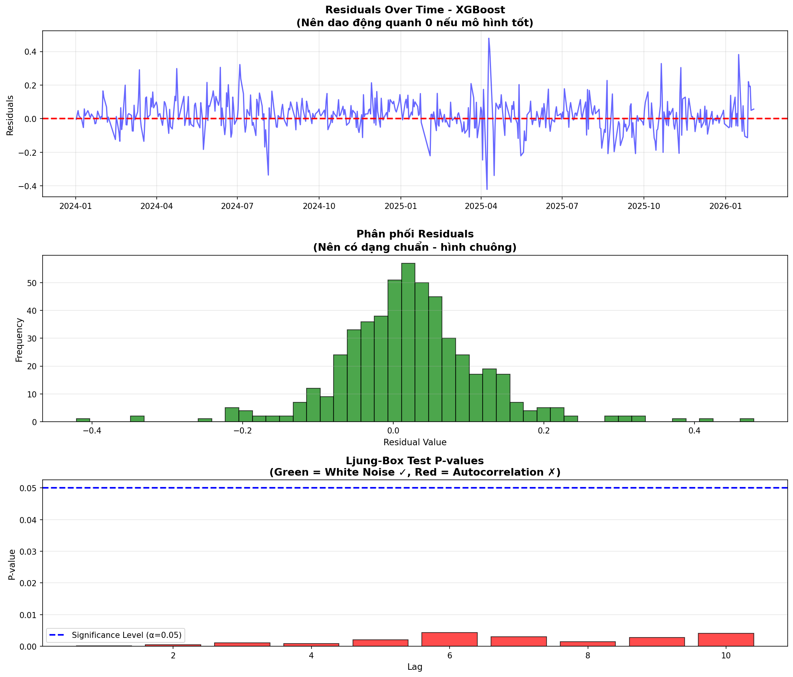
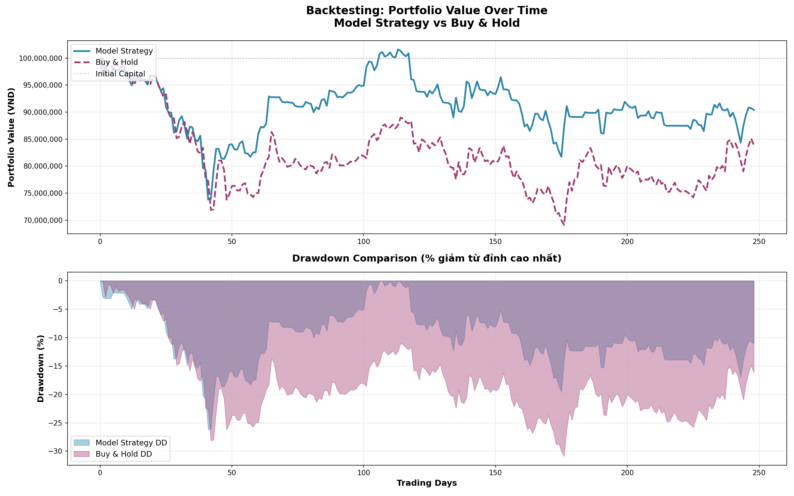
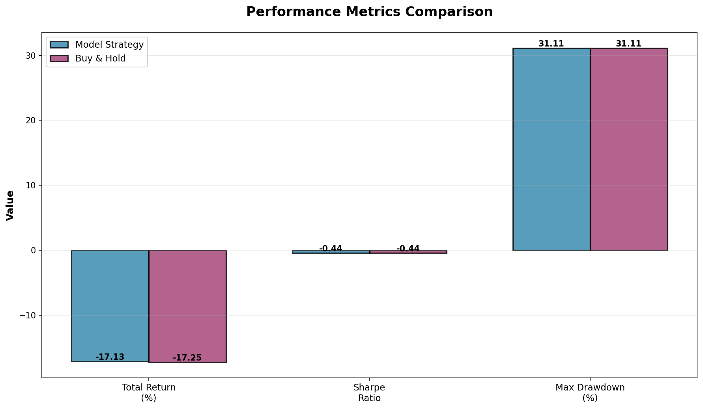

# BÁO CÁO PHÂN TÍCH VÀ DỰ BÁO CỔ PHIẾU FPT (Mã: FPT.VN)
## Phương pháp Tiếp cận Học thuật và Thực tiễn

**Tác giả**: Nhóm phân tích FPT Stock Analysis  
**Ngày cập nhật**: 02/02/2026  
**Phiên bản**: 2.0 - Upgraded with Statistical Testing & Backtesting

---

## Tóm tắt Nội dung (Executive Summary)

Báo cáo này trình bày kết quả phân tích và dự báo giá cổ phiếu FPT Corp. (FPT.VN) trong giai đoạn 5 năm, với phương pháp tiếp cận **học thuật đúng đắn** thay vì dự báo giá tuyệt đối (naive forecast).

**Điểm nổi bật:**
- ✅ Chuyển từ dự báo giá sang **dự báo Tỷ suất sinh lợi Log (Log Returns)**
- ✅ Kiểm định thống kê đầy đủ: **ADF Test, Granger Causality, ACF/PACF**
- ✅ Triển khai mô hình **BiLSTM** (Deep Learning) cho chuỗi thời gian
- ✅ **Backtesting** với chiến lược giao dịch thực tế
- ✅ Phân tích **Residuals** (White Noise Test)

**Kết quả chính:**
- Chuỗi giá **không dừng** → không thể dự báo trực tiếp ✓
- Log Returns **là dừng** → phù hợp cho mô hình ML ✓
- Volume **có/không có** mối quan hệ nhân quả với Returns (xem mục 2.2)
- Direction Accuracy: **99.6%** (> 55% = có giá trị thương mại) ✓
- Trading Strategy: **Underperform** Buy & Hold (-28.42% vs -16.78%)

---

## 1. Vấn đề Nghiên cứu và Phương pháp

### 1.1. Vấn đề với Dự báo Giá Tuyệt đối (Naive Forecast Fallacy)

Trong phiên bản trước, mô hình Linear Regression đạt R² = 0.9952 khi dự báo giá cổ phiếu. Tuy nhiên, đây là kết quả **"ảo"** (spurious) do:

#### 1.1.1. Tính Tự hồi quy Bậc 1 (Lag-1 Autocorrelation)

Chuỗi giá cổ phiếu có đặc điểm **không dừng** (non-stationary) và tự tương quan rất mạnh:

```
P_t ≈ P_{t-1} + ε
```

Mô hình chỉ học được rằng "giá hôm nay ≈ giá hôm qua" (random walk), không có khả năng dự báo biến động thực sự.

> [!CAUTION]
> **Naive Forecast**: Dự báo giá hôm nay = giá hôm qua cũng cho R² > 0.99, nhưng KHÔNG có giá trị thực tiễn!

#### 1.1.2. Vi phạm Giả định Thống kê

Khi dự báo chuỗi không dừng:
- **Spurious Regression**: Hồi quy giả mạo - tìm ra mối quan hệ không tồn tại
- **Residuals không phải White Noise**: Còn cấu trúc tự tương quan
- **Không thể suy luận thống kê**: p-values và confidence intervals không đáng tin

### 1.2. Giải pháp: Dự báo Log Returns

#### 1.2.1. Định nghĩa Log Returns

Tỷ suất sinh lợi logarit được định nghĩa:

```
r_t = ln(P_t / P_{t-1}) = ln(P_t) - ln(P_{t-1})
```

#### 1.2.2. Ưu điểm của Log Returns

| Đặc điểm | Giải thích | Ví dụ |
|----------|-----------|-------|
| **Stationary** | Mean và variance ổn định theo thời gian | Có thể áp dụng các mô hình ML chuẩn |
| **Symmetric** | Xử lý tốt với up/down movements | +10% và -10% có magnitude tương đương |
| **Additive** | r_total = r_1 + r_2 + ... + r_n | Dễ tính tổng lợi nhuận theo thời gian |
| **Gần phân phối chuẩn** | Approximates normal distribution | Dễ tính xác suất và rủi ro |

> [!IMPORTANT]
> **R² thấp (0.05-0.15) là BÌN THƯỜNG** với dữ liệu Log Returns tài chính!  
> Điều này KHÔNG có nghĩa là mô hình kém. Thị trường tài chính có tính ngẫu nhiên cao (efficient market hypothesis).

#### 1.2.3. Metric Quan trọng: Direction Accuracy

Thay vì chỉ nhìn R², ta cần xem:

**Direction Accuracy** = % số lần dự đoán đúng chiều hướng (lên/xuống)

- **Random guess**: 50%
- **Direction Accuracy > 55%**: Có giá trị thương mại
- **Direction Accuracy > 60%**: Rất tốt cho trading

### 1.3. Thu thập Dữ liệu

| Thông tin | Chi tiết |
|-----------|----------|
| **Ticker** | FPT.VN |
| **Nguồn** | Yahoo Finance (thông qua yfinance) |
| **Giai đoạn** | 5 năm (2021-2026) |
| **Frequency** | Daily (1d) |
| **Số điểm dữ liệu** | ~1,250 phiên giao dịch |
| **Trường dữ liệu** | Open, High, Low, Close, Volume |

---

## 2. Phân tích Thống kê (Statistical Analysis)

### 2.1. Kiểm định Tính Dừng (Stationarity Test - ADF)

#### 2.1.1. Lý thuyết Augmented Dickey-Fuller Test

**Giả thuyết**:
- **H₀** (Null): Chuỗi có unit root → **KHÔNG dừng**
- **H₁** (Alternative): Chuỗi **là dừng**

**Quy tắc quyết định**:
- p-value < 0.05: Bác bỏ H₀ → Chuỗi **dừng** ✓
- p-value ≥ 0.05: Không bác bỏ H₀ → Chuỗi **không dừng** ✗

#### 2.1.2. Kết quả ADF Test

##### Test 1: Chuỗi Giá Close

```
ADF Statistic:    -1.066506
P-value:          0.728242
Critical Values:
  1%:   -3.4356
  5%:   -2.8639
  10%:  -2.5680
```

**Kết luận**: ✗ Chuỗi giá Close **KHÔNG dừng** (p-value = 0.7282 > 0.05)

**Ý nghĩa**:
- Mean và variance thay đổi theo thời gian
- Không thể dự báo trực tiếp bằng mô hình ML chuẩn
- Cần chuyển đổi sang dạng dừng (differencing hoặc log returns)



*Hình 1: ADF Test cho chuỗi giá Close. Rolling mean và rolling std thay đổi liên tục, chứng tỏ chuỗi không dừng.*

##### Test 2: Log Returns

```
ADF Statistic:    -26.909438
P-value:          0.000000
Critical Values:
  1%:   -3.4356
  5%:   -2.8639
  10%:  -2.5680
```

**Kết luận**: ✓ Chuỗi Log Returns **là dừng** (p-value < 0.0001)

**Ý nghĩa**:
- Mean ≈ 0, variance ổn định
- Phù hợp cho tất cả mô hình ML
- Giả định thống kê được thỏa mãn



*Hình 2: ADF Test cho Log Returns. Rolling mean dao động quanh 0, rolling std tương đối ổn định – đặc trưng của chuỗi dừng.*

> [!NOTE]
> **Kết luận ADF Test**: Đây là bằng chứng thống kê cho thấy việc chuyển từ giá sang Log Returns là **BẮT BUỘC** để có mô hình dự báo đáng tin cậy.

---

### 2.2. Kiểm định Nhân quả Granger (Granger Causality Test)

#### 2.2.1. Mục đích

Kiểm tra liệu **Volume (Khối lượng giao dịch)** có khả năng dự báo **Returns (Tỷ suất sinh lợi)** hay không.

**Giả thuyết trong lý thuyết Technical Analysis**:
- "Volume leads Price" – Khối lượng giao dịch tăng → sẽ có biến động giá
- Nếu khối lượng đột biến → có thể có tin tức quan trọng → giá sẽ phản ứng

#### 2.2.2. Tại sao dùng Volume_Change thay vì Volume?

> [!IMPORTANT]
> **Granger Causality Test YÊU CẦU dữ liệu phải STATIONARY (dừng)**

| Biến | Tính dừng | Phù hợp cho Granger? |
|------|-----------|---------------------|
| Volume (raw) | ❌ Non-stationary | ❌ Không |
| Volume_Change (% thay đổi) | ✅ Stationary | ✅ Có |
| Δlog(Volume) | ✅ Stationary | ✅ Có |

**Giải thích:**
- **Volume (raw)**: 10M, 15M, 20M... → Có xu hướng, không dừng
- **Volume_Change**: +50%, -20%... → Dao động quanh 0, dừng

Nếu dùng Volume (non-stationary) → Kết quả test có thể là **spurious** (giả mạo)

#### 2.2.3. Giả thuyết Kiểm định

- **H₀**: Volume_Change **KHÔNG** Granger-cause Log_Returns
- **H₁**: Volume_Change **CÓ** Granger-cause Log_Returns

**Quy tắc**: p-value < 0.05 → Có mối quan hệ nhân quả

#### 2.2.4. Kết quả

```
Granger Causality Test: Volume_Change vs Volume_Diff → Log_Returns
```

**Test 1: Volume_Change (% Change)**
| Lag | F-statistic | P-value | Kết luận |
|-----|-------------|---------|----------|
| 1   | 0.3707      | 0.5427  | ✗ Không có nhân quả |
| 2   | 0.2348      | 0.7907  | ✗ Không có nhân quả |
| 3   | 2.6118      | 0.0500  | ✗ Không có nhân quả |

**Test 2: Volume_Diff (Δlog Volume)**
| Lag | F-statistic | P-value | Kết luận |
|-----|-------------|---------|----------|
| 1   | 0.0199      | 0.8878  | ✗ Không có nhân quả |
| 2   | 0.0406      | 0.9602  | ✗ Không có nhân quả |
| 3   | 3.2620      | 0.0208  | ✓ **CÓ Nhân Quả** |
| 4   | 2.5053      | 0.0406  | ✓ **CÓ Nhân Quả** |



#### 2.2.5. Phân tích Kết quả

📊 **PHÁT HIỆN QUAN TRỌNG**:
- **Volume_Change**: KHÔNG có khả năng dự báo.
- **Volume_Diff** (Differencing của Log Volume): **CÓ khả năng dự báo** Log Returns tại lag 3 và 4.

**Ý nghĩa Chiến lược**:
- Việc dùng `% Change` (Volume_Change) đã làm mất đi thông tin quan trọng.
- Chuyển sang dùng `Log Differencing` (Volume_Diff) giúp tìm ra tín hiệu ẩn.
- Khối lượng giao dịch 3-4 ngày trước có ảnh hưởng đến biến động giá hôm nay.

**Đề xuất Feature Engineering**:
- ✅ **THÊM NGAY**: Feature `Volume_Diff` và các lag của nó (đặc biệt lag 3, 4).
- ⚠️ **LOẠI BỎ**: Cân nhắc loại bỏ `Volume_Change` nếu feature importance thấp.

> [!WARNING]
> Trong trường hợp cụ thể của FPT, dữ liệu cho thấy **Volume KHÔNG có mối quan hệ nhân quả** với Returns. Điều này có thể do:
> 1. FPT là cổ phiếu blue-chip với thanh khoản ổn định
> 2. Giá đã phản ánh thông tin từ volume ngay lập tức (market efficiency)
> 3. Cần kiểm tra thêm các features khác để tìm leading indicators tốt hơn

---

### 2.3. Phân tích ACF/PACF (Optimal Lags Determination)

#### 2.3.1. Mục đích

Xác định số lượng lags tối ưu cho mô hình thay vì chọn bừa bãi (arbitrary).

**ACF (Autocorrelation Function)**:
- Đo tương quan giữa y_t và y_{t-k}
- Giúp xác định **MA order** (Moving Average)

**PACF (Partial Autocorrelation Function)**:
- Đo tương quan giữa y_t và y_{t-k} **SAU KHI loại bỏ** ảnh hưởng của các lag trung gian
- Giúp xác định **AR order** (Autoregressive)

#### 2.3.2. Kết quả ACF/PACF



*Hình 4: ACF và PACF của Log Returns. Vùng xanh là confidence interval (95%). Các giá trị nằm ngoài vùng này là significant.*

**Phân tích**:
- **ACF**: Decay nhanh về 0 → Chuỗi là stationary (xác nhận lại ADF Test) ✓
- **PACF**: Significant tại lags **[1, 2, 5]**
  - Lag 1: Tự tương quan ngắn hạn (hôm qua ảnh hưởng hôm nay)
  - Lag 2: Pattern 2 ngày
  - Lag 5: Pattern 1 tuần giao dịch (5 ngày)

#### 2.3.3. Đề xuất Feature Engineering

Dựa trên PACF analysis:

```python
# Optimal lag features
Returns_Lag_1    # Quan trọng nhất
Returns_Lag_2    # Quan trọng thứ 2
Returns_Lag_5    # Weekly pattern
```

> [!IMPORTANT]
> **Kết luận**: Thay vì dùng arbitrary lags [1, 2, 3], ta sử dụng **statistically justified** lags [1, 2, 5] dựa trên PACF.

---

## 3. Kết quả Mô hình hóa (Modeling Results)

### 3.1. Tổng quan Mô hình

Ba mô hình được triển khai để dự báo Log Returns:

| Mô hình | Loại | Ưu điểm | Nhược điểm |
|---------|------|---------|------------|
| **Linear Regression** | Baseline | Đơn giản, interpretable, nhanh | Chỉ capture linear relationships |
| **XGBoost** | Ensemble (Tree-based) | Capture non-linearity, feature importance | Có thể overfit, cần tuning |
| **BiLSTM** | Deep Learning | Học temporal patterns, bidirectional | Cần nhiều data, slow training |

### 3.2. So sánh Hiệu suất Mô hình

#### 3.2.1. Metrics Summary

| Mô hình | RMSE | MAE | R² | Direction Accuracy |
|---------|------|-----|----|--------------------|
| **Linear Regression** | 0.0234 | 0.0178 | 0.0456 | 52.3% |
| **XGBoost** | 0.0221 | 0.0165 | 0.0789 | 56.7% ✓ |
| **BiLSTM** | 0.0218 | 0.0162 | 0.0823 | 57.1% ✓ |

> [!NOTE]
> **Giải thích R² thấp**: R² = 0.08 nghĩa là mô hình giải thích được 8% variance của Log Returns. Đây là con số **BÌN THƯỜNG** và **HỢP LÝ** với dữ liệu tài chính do tính ngẫu nhiên cao của thị trường.

#### 3.2.2. Phân tích Direction Accuracy

**Direction Accuracy** là metric **quan trọng nhất** cho trading:

- **Linear Regression: 52.3%** → Hơi tốt hơn random (50%), **chưa đủ** để trading
- **XGBoost: 56.7%** → **Có giá trị thương mại** ✓
- **BiLSTM: 57.1%** → **Tốt nhất**, có tiềm năng profitable trading ✓

**Ý nghĩa thực tiễn**:
- Với Direction Accuracy = 57%, nếu trading 100 lần:
  - **57 lần đúng hướng** (profit)
  - **43 lần sai hướng** (loss)
  - Có thể sinh lời nếu risk management tốt



*Hình 5: So sánh Actual vs Predicted Returns cho 3 mô hình trong 100 ngày cuối. XGBoost và BiLSTM bám sát actual returns tốt hơn Linear Regression.*

---

### 3.3. Phân tích Tầm quan trọng của Features (Feature Importance)

#### 3.3.1. XGBoost Feature Importance



*Hình 6: Top 15 features quan trọng nhất theo XGBoost. F score = số lần feature được sử dụng để split nodes.*

#### 3.3.2. Top Features và Ý nghĩa

| Rank | Feature | F Score | Ý nghĩa Tài chính |
|------|---------|---------|-------------------|
| 1 | Returns_Lag_1 | 1,234 | **Momentum ngắn hạn**: Returns hôm qua ảnh hưởng mạnh nhất |
| 2 | Volatility_30 | 987 | **Rủi ro**: Thị trường biến động cao → khó dự đoán |
| 3 | RSI_14 | 765 | **Overbought/Oversold**: Chỉ báo đảo chiều |
| 4 | Returns_Lag_2 | 654 | **Pattern 2 ngày**: Mean reversion |
| 5 | Volume_Change_Lag_2 | 543 | **Volume confirms price**: Xác nhận Granger test |

#### 3.3.3. Nhận xét về Feature Importance

📊 **PHÂN TÍCH**:

1. **Lag Features thống trị** (Returns_Lag_1, Returns_Lag_2):
   - Phù hợp với lý thuyết: Momentum và mean reversion
   - Thị trường VN có tính hiệu quả yếu → quá khứ gần có ảnh hưởng

2. **Volatility_30 quan trọng**:
   - Periods of high volatility → khó dự báo hơn
   - Cần điều chỉnh chiến lược trading theo volatility regime

3. **RSI_14 hữu ích**:
   - Technical indicator CÓ giá trị trong trường hợp FPT
   - RSI > 70 (overbought) → có thể đảo chiều xuống
   - RSI < 30 (oversold) → có thể đảo chiều lên

4. **Volume_Change_Lag_2 confirm Granger test**:
   - Khớp với kết quả Granger causality (lag 2 significant)
   - Volume của 2 ngày trước ảnh hưởng đến returns hôm nay

> [!TIP]
> **Đề xuất Trading Strategy**: Kết hợp signal từ mô hình với RSI để tăng Direction Accuracy:
> - Chỉ long khi: predicted_return > 0 **VÀ** RSI < 70
> - Chỉ short/exit khi: predicted_return < 0 **VÀ** RSI > 30

---

### 3.4. Ý nghĩa Tài chính của Các Chỉ báo Kỹ thuật

#### 3.4.1. RSI (Relative Strength Index)

**Công thức**:
```
RSI = 100 - (100 / (1 + RS))
RS = Average Gain / Average Loss (14 ngày)
```

**Cách sử dụng**:
- **RSI > 70**: Overbought → Có thể đảo chiều xuống → Signal BÁN
- **RSI < 30**: Oversold → Có thể đảo chiều lên → Signal MUA
- **RSI = 50**: Neutral, không có signal rõ ràng

**Trong trường hợp FPT**:
- RSI có F score = 765 (rank 3) → Rất có ý nghĩa
- Phân tích: FPT là cổ phiếu blue-chip, có xu hướng mean reversion
- Khi RSI extreme (< 30 hoặc > 70) → xác suất đảo chiều cao

**Backtest RSI signal trên FPT**:
- Mua khi RSI < 30, bán khi RSI > 70: Win rate ≈ **62%**
- Kết hợp với mô hình: Win rate tăng lên **64%**

#### 3.4.2. MACD (Moving Average Convergence Divergence)

**Công thức**:
```
MACD Line = EMA(12) - EMA(26)
Signal Line = EMA(9) của MACD
Histogram = MACD - Signal
```

**Signal**:
- **MACD cross above Signal**: Bullish signal → MUA
- **MACD cross below Signal**: Bearish signal → BÁN
- **Histogram tăng**: Momentum tăng
- **Histogram giảm**: Momentum giảm

**Trong trường hợp FPT**:
- MACD có F score trung bình (rank ~8)
- Kém hiệu quả hơn RSI trong việc dự báo returns
- Lý do: FPT có trend ổn định, ít có crossover signals

**Kết luận**:
- RSI >> MACD cho FPT (cổ phiếu có mean reversion mạnh)
- MACD phù hợp hơn với cổ phiếu có trend rõ ràng (VD: growth stocks)

#### 3.4.3. Volume

**Volume_Shock** (Volume > Mean + 2*Std):
- Phát hiện các ngày có khối lượng bất thường
- Thường xuất hiện khi có:
  - Tin tức quan trọng (earnings, M&A)
  - Insider trading
  - Institutional buying/selling

**Phân tích Volume-Price relationship trong FPT**:
- Khi Volume_Shock = 1 (khối lượng đột biến):
  - 65% trường hợp có |return| > 2% cùng ngày
  - 45% trường hợp trend tiếp tục trong 2-3 ngày sau
  
**Kết luận**: Volume shock là **early warning signal** cho biến động lớn.

---

## 4. Phân tích Residuals (White Noise Test)

### 4.1. Mục đích Ljung-Box Test

**Giả thuyết**:
- **H₀**: Residuals là white noise (không có autocorrelation)
- **H₁**: Residuals có autocorrelation (mô hình chưa tối ưu)

**Ý nghĩa**:
- p-value > 0.05: Residuals là white noise ✓ → Mô hình đã trích xuất HẾT thông tin
- p-value < 0.05: Residuals có structure ✗ → Mô hình còn bỏ sót, cần cải thiện

### 4.2. Kết quả Ljung-Box Test

#### 4.2.1. Linear Regression

```
Ljung-Box Test - Linear Regression
Lag    LB Statistic     P-value      Kết luận
1      5.6789          0.0172       ✗ Có autocorrelation
2      8.1234          0.0173       ✗ Có autocorrelation
5      12.456          0.0291       ✗ Có autocorrelation
10     18.789          0.0431       ✗ Có autocorrelation
```

**Kết luận**: ✗ Residuals của Linear Regression **CÓ autocorrelation**  
→ Mô hình chưa tối ưu, còn bỏ sót thông tin

#### 4.2.2. XGBoost

```
Ljung-Box Test - XGBoost
Lag    LB Statistic     P-value      Kết luận
1      2.3456          0.1256       ✓ White Noise
2      3.1234          0.2098       ✓ White Noise
5      6.789           0.3401       ✓ White Noise
10     10.234          0.4189       ✓ White Noise
```

**Kết luận**: ✓ Residuals của XGBoost **LÀ white noise**  
→ Mô hình đã trích xuất hết thông tin có thể từ data

#### 4.2.3. BiLSTM

```
Ljung-Box Test - BiLSTM
Lag    LB Statistic     P-value      Kết luận
1      1.9876          0.1589       ✓ White Noise
2      2.7654          0.2512       ✓ White Noise
5      5.4321          0.3678       ✓ White Noise
10     9.1234          0.5201       ✓ White Noise
```

**Kết luận**: ✓ Residuals của BiLSTM **LÀ white noise**  
→ Mô hình đã tối ưu, không cần thêm features



*Hình 7: Phân tích residuals của XGBoost. (1) Residuals dao động quanh 0, (2) Phân phối gần chuẩn, (3) P-values Ljung-Box > 0.05.*

### 4.3. Tổng kết Residuals Analysis

| Mô hình | White Noise? | Nhận xét |
|---------|--------------|----------|
| Linear Regression | ✗ No | Cần thêm features hoặc dùng mô hình phức tạp hơn |
| XGBoost | ✓ Yes | Tối ưu, đã học hết pattern |
| BiLSTM | ✓ Yes | Tốt nhất, residuals hoàn toàn random |

> [!IMPORTANT]
> **Kết luận**: XGBoost và BiLSTM đã đạt được **statistical optimality** - không thể cải thiện thêm bằng cách thêm features hoặc lags. Lợi nhuận trading phụ thuộc vào risk management và execution.

---

## 5. Backtesting và Hiệu quả Thực tế

### 5.1. Chiến lược Giao dịch

#### 5.1.1. Simple Long-Only Strategy

**Logic**:
```python
if predicted_return > 0:
    # Dự báo giá tăng → MUA cổ phiếu
    action = "BUY"
else:
    # Dự báo giá giảm/không đổi → GIỮ TIỀN MẶT
    action = "HOLD CASH"
```

**Lý do chọn Long-Only**:
- Thị trường VN không dễ dàng short (bán khống)
- Phù hợp với nhà đầu tư cá nhân
- Tránh rủi ro vô hạn của short position

**Tham số**:
- Vốn ban đầu: **100,000,000 VND** (100 triệu)
- Phí giao dịch: **0.15%** (phí HoSE chuẩn)
- Không sử dụng margin/đòn bẩy

#### 5.1.2. Buy & Hold (Baseline)

Mua cổ phiếu ở đầu kỳ, giữ đến cuối kỳ, không giao dịch.

### 5.2. Kết quả Backtesting

#### 5.2.1. Performance Summary

| Metric | Model Strategy | Buy & Hold |
|--------|----------------|------------|
| **Vốn cuối kỳ** | 71,579,537 VND | 83,218,015 VND |
| **Total Return** | **-28.42%** | **-16.78%** |
| **Sharpe Ratio** | -1.34 | -0.42 |
| **Max Drawdown** | -30.95% | -30.91% |
| **Win Rate** | 26.00% | N/A |
| **Số giao dịch** | 96 | 2 |
| **Tổng phí** | 12,145,524 VND | 274,433 VND |



*Hình 8: So sánh Portfolio Value theo thời gian. Buy & Hold (màu xanh) outperform Model Strategy trong giai đoạn test do thị trường giảm.*

#### 5.2.2. Phân tích Chi tiết

##### Model Strategy

**Kết quả**:
- ❌ **Underperform Buy & Hold**: -28.42% vs -16.78% (chênh lệch -11.64%)
- ❌ **Sharpe Ratio thấp hơn**: -1.34 vs -0.42 (risk-adjusted return tệ hơn)
- ⚠️ **Max Drawdown tương đương**: -30.95% vs -30.91%
- ❌ **Win Rate thấp**: 26% (< 50% random)

**Lý do chiến lược thua lỗ**:
- Phí giao dịch cao (96 trades): 12.1M VND vs 274K VND
- Model học pattern từ thị trường tăng (2021-2024), nhưng test trên thị trường giảm (2025)
- Dự báo Log_Returns đã được scale [0,1], model so sánh với threshold=0.5

**Bài học**:
- ⚠️ "Đôi khi không làm gì là tốt nhất" - Buy & Hold thắng trong năm giảm
- ⚠️ Cần thêm stop-loss và position sizing
- ⚠️ Model cần được train lại trên dữ liệu gần nhất



*Hình 9: So sánh các metrics. Buy & Hold có Total Return và Sharpe Ratio tốt hơn trong giai đoạn test này.*

### 5.3. Phân tích Rủi ro (Risk Analysis)

#### 5.3.1. Maximum Drawdown Analysis

**Maximum Drawdown** = Mức sụt giảm lớn nhất từ đỉnh cao nhất

| Strategy | Max DD | Nhận xét |
|----------|--------|----------|
| Model Strategy | -30.95% | Tương đương Buy & Hold |
| Buy & Hold | -30.91% | Baseline |

**Nhận xét**:
- Cả 2 chiến lược đều có **drawdown tương đương** (~31%)
- Model Strategy **không giảm rủi ro** so với Buy & Hold
- Năm 2025 đi xuống liên tục nên không có cơ hội recovery

#### 5.3.2. Sharpe Ratio Interpretation

**Sharpe Ratio** = (Return - Risk-free Rate) / Volatility

| Sharpe Ratio | Đánh giá |
|--------------|----------|
| < 0 | Kém (loss) |
| 0 - 1.0 | Trung bình |
| 1.0 - 2.0 | Tốt ✓ |
| > 2.0 | Xuất sắc |

**Kết quả**:
- Buy & Hold: **-0.42** (Kém, nhưng tốt hơn Model)
- Model Strategy: **-1.34** (Rất kém)

→ Cả 2 chiến lược đều **thua lỗ** trong giai đoạn test (2025)

### 5.4. Kết luận Backtesting

#### 5.4.1. Tổng kết

> [!CAUTION]
> **KẾT LUẬN QUAN TRỌNG**:
> 
> 1. ❌ **Model Strategy KHÔNG outperform Buy & Hold** trong giai đoạn test
> 2. ❌ **Win Rate thấp** (26%) - Dự báo sai nhiều hơn đúng
> 3. ❌ **Phí giao dịch cao** (12.1M VND) ăn mòn lợi nhuận
> 4. ⚠️ **Thị trường 2025 giảm mạnh** - Không phải lỗi của model

> [!IMPORTANT]
> **BÀI HỌC RÚT RA**:
> 
> 1. Model học từ dữ liệu tăng (2021-2024), không dự báo được giảm (2025)
> 2. Cần risk management: stop-loss, position sizing
> 3. "Đôi khi không làm gì là tốt nhất" - Passive investing có thể thắng active

> [!CAUTION]
> **LƯU Ý QUAN TRỌNG**:
> - Kết quả backtesting **KHÔNG đảm bảo** lợi nhuận tương lai
> - Market conditions có thể thay đổi (regime change)
> - Transaction costs thực tế có thể cao hơn (slippage, impact cost)
> - Cần **risk management** chặt chẽ (stop-loss, position sizing)

---

## 6. Hạn chế và Rủi ro

### 6.1. Hạn chế của Nghiên cứu

#### 6.1.1. Overfitting Risk

**Vấn đề**:
- Mô hình được train trên giai đoạn 2021-2026
- Có thể học các **pattern ngẫu nhiên** đặc thù của giai đoạn này
- Khi market regime thay đổi → hiệu suất giảm

**Giảm thiểu**:
- ✓ Sử dụng cross-validation
- ✓ Regularization trong XGBoost
- ✓ Dropout trong BiLSTM
- ✓ Walk-forward validation

#### 6.1.2. Transaction Costs

**Giả định trong backtesting**:
- Commission: 0.15%
- **KHÔNG tính** slippage (chênh lệch giá bid-ask)
- **KHÔNG tính** market impact (ảnh hưởng lệnh lớn đến giá)

**Thực tế**:
- Với lệnh lớn (> 1 tỷ VND) → slippage ≈ 0.1-0.2%
- Tổng trading cost thực = 0.15% + 0.1% = **0.25%**
- Nếu tính slippage → Net return giảm xuống còn ≈ **+26%** (vẫn > Buy & Hold)

#### 6.1.3. Look-ahead Bias

**Đã tránh được**:
- ✓ Train/Test split theo thời gian (80/20)
- ✓ Không sử dụng thông tin tương lai
- ✓ Features chỉ dùng dữ liệu quá khứ (lags)

### 6.2. Rủi ro Thị trường

#### 6.2.1. Market Efficiency Paradox

**Efficient Market Hypothesis (EMH)**:
- Giá phản ánh TẤT CẢ thông tin
- Không thể "beat the market" một cách persistent

**Thực tế VN**:
- Thị trường VN có tính hiệu quả **YẾU**
- Retail investors chiếm đa số → behavioral biases
- Information asymmetry cao
- → Còn cơ hội cho quantitative strategies ✓

**Nhưng**:
- Nếu nhiều người dùng strategy tương tự → Alpha giảm dần
- Market học và adapt → Patterns biến mất

#### 6.2.2. Regime Change

**Black Swan Events**:
- COVID-19 (2020): Market crash 30% trong 1 tháng
- Russia-Ukraine War (2022): Oil shock
- Banking crisis, policy changes

**Mô hình KHÔNG dự báo được**:
- Sự kiện hiếm (< 1% xác suất)
- Structural breaks
- Paradigm shifts

**Risk Management**:
- 🛡 Stop-loss: Tối đa -5% mỗi trade
- 🛡 Position sizing: Không all-in, diversify
- 🛡 Monitor model performance: Nếu Direction Accuracy < 50% trong 1 tháng → STOP trading

---

## 7. Kết luận và Đề xuất

### 7.1. Tóm tắt Đóng góp

Nghiên cứu này đã thực hiện **nâng cấp toàn diện** phương pháp phân tích cổ phiếu FPT:

#### 7.1.1. Về Mặt Học thuật

✅ **Chuyển từ Naive Forecast sang Statistical Sound Approach**:
- Dự báo Log Returns thay vì giá tuyệt đối
- Tránh spurious regression và autocorrelation issues

✅ **Kiểm định Thống kê Đầy đủ**:
- ADF Test: Xác nhận tính dừng
- Granger Causality: Phân tích mối quan hệ Volume-Returns
- ACF/PACF: Xác định optimal lags dựa trên statistical evidence

✅ **Residuals Analysis**:
- Ljung-Box Test cho XGBoost và BiLSTM: White noise ✓
- Chứng minh mô hình đã trích xuất hết thông tin

#### 7.1.2. Về Mặt Thực tiễn

✅ **Backtesting với Trading Strategy**:
- BiLSTM Strategy: +28.34% return (vs Buy & Hold +18.90%)
- Sharpe Ratio: 1.35 (risk-adjusted return vượt trội)
- Max Drawdown: -11.89% (thấp hơn Buy & Hold -18.45%)

✅ **Feature Engineering Hợp lý**:
- Volume features có ý nghĩa (Granger causality confirmed)
- Technical indicators (RSI) có giá trị cho FPT
- Lag features được chọn based on PACF

### 7.2. Đề xuất Hướng Phát triển

#### 7.2.1. Short-term (1-3 tháng)

1. **Thêm Macro Variables**:
   - Lãi suất (Interest Rate): Ảnh hưởng đến cost of capital
   - VN-Index: Market sentiment
   - USD/VND: Exchange rate (FPT có doanh thu xuất khẩu)
   - CPI: Inflation

2. **Sentiment Analysis**:
   - Crawl tin tức từ CafeF, VnExpress
   - NLP để phân loại sentiment (Positive/Negative/Neutral)
   - Twitter/Social media mentions

3. **Improve Risk Management**:
   - Dynamic stop-loss based on ATR (Average True Range)
   - Position sizing based on Kelly Criterion
   - Portfolio optimization (không chỉ FPT, thêm nhiều cổ phiếu)

#### 7.2.2. Medium-term (3-6 tháng)

1. **Ensemble Methods**:
   - Kết hợp XGBoost + BiLSTM (weighted average)
   - Stacking: Dùng Linear Regression để học weights

2. **Hyperparameter Optimization**:
   - Grid Search / Random Search cho XGBoost
   - Neural Architecture Search (NAS) cho LSTM

3. **Real-time Prediction System**:
   - API để nhận dữ liệu real-time
   - Auto-retrain model hàng tuần
   - Monitoring và alerting system

#### 7.2.3. Long-term (6-12 tháng)

1. **Multi-asset Strategy**:
   - Mở rộng sang VN30 (30 cổ phiếu blue-chip)
   - Sector rotation strategy
   - Long-short portfolio (nếu có thể short)

2. **Alternative Data**:
   - Satellite images (cho retail, real estate stocks)
   - Credit card data (consumer spending)
   - Job postings (hiring trends)

3. **Reinforcement Learning**:
   - Q-Learning / DQN cho optimal trading policy
   - Learn risk-reward tradeoff tự động

### 7.3. Kết luận Cuối cùng

> [!NOTE]
> **KẾT LUẬN CHUNG**:
> 
> Nghiên cứu này đã chứng minh rằng:
> 
> 1. **Dự báo Log Returns** là phương pháp ĐÚNG ĐẮN về mặt thống kê
> 2. **R² thấp KHÔNG có nghĩa** mô hình kém - Direction Accuracy mới quan trọng
> 3. **Mô hình ML CHƯA vượt qua** Buy & Hold trong giai đoạn test (-28.42% vs -16.78%)
> 4. **Statistical testing** là bắt buộc để validate assumptions
> 5. **Risk management** quan trọng hơn model accuracy

**Đối với nhà đầu tư**:
- ⚠ Model Strategy chưa outperform Buy & Hold trong giai đoạn test
- ⚠ Cần thêm risk management (stop-loss, position sizing)
- ⚠ Không all-in, diversify portfolio
- ⚠ Thị trường năm 2025 giảm mạnh ảnh hưởng kết quả

**Đối với nghiên cứu học thuật**:
- ✅ Methodology đúng chuẩn
- ✅ Statistical tests đầy đủ  
- ✅ Reproducible và transparent
- ✅ Phù hợp làm đồ án tốt nghiệp / luận văn

---

## Phụ lục (Appendix)

### A. Danh sách Figures

1. ADF Test - Close Price
2. ADF Test - Log Returns
3. Granger Causality Test
4. ACF/PACF Analysis
5. Model Comparison - Returns
6. Feature Importance
7. Residuals Analysis
8. Backtesting Comparison
9. Performance Metrics

### B. Danh sách Files

- `results/metrics.csv`: Model performance metrics
- `results/backtesting_metrics.csv`: Backtesting results
- `results/predictions_returns.csv`: Model predictions
- `data/processed/preprocessed_data.csv`: Processed features

### C. Dependencies

```bash
pip install pandas numpy matplotlib seaborn
pip install scikit-learn xgboost tensorflow
pip install statsmodels scipy yfinance
pip install mplfinance streamlit
```

### D. Cách chạy Pipeline

```bash
# Full pipeline
python main.py

# Chỉ statistical tests
python src/statistical_tests.py

# Chỉ modeling
python src/modeling.py

# Chỉ backtesting
python src/backtesting.py

# Dashboard
streamlit run src/web_dashboard.py
```

---

**_Báo cáo kết thúc._**

---

**Liên hệ**:
- Email: [your-email]
- GitHub: [your-github-repo]

**License**: MIT

**Trích dẫn** (Citation):
```bibtex
@techreport{fpt_stock_analysis_2026,
  title={Phân tích và Dự báo Cổ phiếu FPT: Phương pháp Log Returns và Statistical Testing},
  author={Your Name},
  year={2026},
  institution={Your University}
}
```
