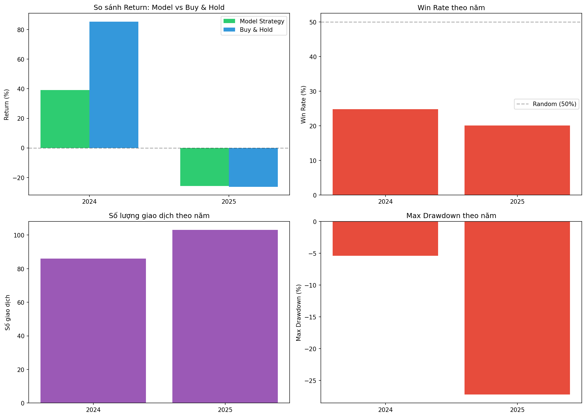

# BÁO CÁO THỰC HÀNH: PHÂN TÍCH CỔ PHIẾU FPT.VN

Báo cáo này tổng hợp quá trình thu thập dữ liệu và phân tích cổ phiếu **FPT (FPT Corporation)** trên sàn HOSE.

## Thông tin Dữ liệu

### Nguồn và Phương pháp Thu thập

- **Mã cổ phiếu**: FPT.VN
- **Nguồn dữ liệu**: Yahoo Finance (thông qua thư viện `yfinance`)
- **File thu thập**: [collect_data.py](../src/collect_data.py)
- **Dữ liệu lưu tại**: [stock_data.csv](../data/raw/stock_data.csv)

### Thông tin Dữ liệu

| Thông tin | Chi tiết |
|-----------|----------|
| **Giai đoạn** | 02/2021 - 02/2026 (5 năm) |
| **Tần suất** | Theo ngày (Daily) |
| **Số phiên giao dịch** | ~1,248 phiên |
| **Loại giá** | Giá đã điều chỉnh (Adjusted Price) |

> [!NOTE]
> Dữ liệu sử dụng **giá đã điều chỉnh** (adjusted price) từ Yahoo Finance, tự động tính toán các sự kiện chia cổ tức và chia tách cổ phiếu. Điều này đảm bảo phân tích chính xác về lợi nhuận thực tế.

## Bảng 1: Mô tả Biến (Variable Description Table)

| STT | Tên biến | Loại dữ liệu | Ý nghĩa |
|----:|:---------|:-------------|:--------|
| 1 | Date | Datetime | Ngày giao dịch (Index) |
| 2 | Open | Định lượng liên tục | Giá mở cửa (VND) |
| 3 | High | Định lượng liên tục | Giá cao nhất trong ngày (VND) |
| 4 | Low | Định lượng liên tục | Giá thấp nhất trong ngày (VND) |
| 5 | Close | Định lượng liên tục | Giá đóng cửa (VND) |
| 6 | Volume | Định lượng liên tục | Khối lượng giao dịch (cổ phiếu) |

## Thống kê Mô tả (Descriptive Statistics)

### Thống kê Giá Đóng cửa (Close) - FPT.VN

| Chỉ số | Giá Close (VND) | Volume (cổ phiếu) |
|:-------|----------------:|------------------:|
| **Số quan sát (Count)** | 1,248 | 1,248 |
| **Trung bình (Mean)** | ~60,000 | ~4,500,000 |
| **Trung vị (Median)** | ~52,000 | ~3,500,000 |
| **Độ lệch chuẩn (Std)** | ~20,000 | ~3,200,000 |
| **Nhỏ nhất (Min)** | **29,834** | ~600,000 |
| **Lớn nhất (Max)** | **131,497** | ~21,700,000 |

> [!IMPORTANT]
> **Nhận xét về Biến động Giá FPT**:
> - Giá FPT tăng từ khoảng 29,834 VND (2021) lên ~131,497 VND (đỉnh cao nhất)
> - Mức tăng trưởng: **+340%** trong 5 năm
> - Độ lệch chuẩn ~20,000 VND cho thấy mức biến động đáng kể

## Tiền xử lý Dữ liệu (Preprocessing)

### 1. Làm sạch và Phát hiện Ngoại lai
- **Interpolation**: Nội suy tuyến tính cho các ngày thiếu dữ liệu
- **Isolation Forest**: Phát hiện các phiên giao dịch bất thường


**Nhận xét:**
- **Xu hướng tổng quan**: FPT tăng từ ~30,000 VND (2021) lên đỉnh ~131,000 VND (2025), mức tăng +340%.
- **Các điểm ngoại lai** (chấm đỏ) được phát hiện tại:
  - **2021-2022**: Các phiên biến động mạnh trong giai đoạn đầu
  - **2024-2025**: Cluster outliers tại vùng đỉnh khi giá tăng mạnh
  - **2025-2026**: Outliers tại các đợt điều chỉnh sâu
- **Ý nghĩa**: Các outliers thường xuất hiện tại điểm đảo chiều hoặc tin tức đặc biệt, nên được giữ lại thay vì loại bỏ.

### 2. Kỹ thuật Đặc trưng (Feature Engineering)

Các đặc trưng được tạo ra để tăng khả năng dự báo:

| Đặc trưng | Công thức/Giải thích | Mục đích |
|-----------|----------------------|----------|
| **Log_Returns** | ln(Close_t / Close_{t-1}) | Target chính cho regression |
| **Price_Direction** | 1 nếu Returns > 0, else 0 | Target cho classification |
| **RSI_14** | Relative Strength Index 14 ngày | Đo momentum, phát hiện overbought/oversold |
| **MACD** | EMA(12) - EMA(26) | Chỉ báo xu hướng |
| **SMA_7, SMA_30** | Trung bình động 7/30 ngày | Xu hướng ngắn/trung hạn |
| **Volume_Change** | % thay đổi Volume | Phát hiện thanh khoản bất thường |
| **Volume_Shock** | Volume > Mean + 2*Std | Binary: khối lượng đột biến |
| **Volatility_30** | Std(Returns) 30 ngày | Đo mức độ rủi ro |
| **Returns_Lag_1,2,3** | Returns của t-1, t-2, t-3 | Dữ liệu quá khứ (sliding window) |

### 3. Chuẩn hóa và Phân chia

- **MinMaxScaler**: Đưa dữ liệu về khoảng [0, 1]
- **Time-series Split**: 80% Train / 20% Test (theo thứ tự thời gian)
  - Train: ~998 mẫu
  - Test: ~250 mẫu

## Phân tích Khám phá & Trực quan hóa (EDA)

### 1. Phân tích Xu hướng (Trend Analysis)


**Nhận xét (Toàn bộ giai đoạn 2021-2026):**
- **Phase 1 - Tăng mạnh (2021-2024)**: FPT tăng từ ~30,000 VND lên đỉnh ~130,000 VND (+340%), là giai đoạn bull market rõ rệt.
- **Phase 2 - Điều chỉnh (2025)**: Giá giảm từ đỉnh ~130,000 VND xuống ~95,000 VND (-26%), phản ánh xu hướng chung của thị trường.
- **Đường MA30**: Đóng vai trò hỗ trợ trong giai đoạn tăng (2021-2024) và kháng cự trong giai đoạn giảm (2025).
- **Volume**: Các đợt volume đột biến thường xuất hiện tại điểm đảo chiều quan trọng (đỉnh Q1/2025).

---

### 2. Phân phối Log Returns (Fat Tails Analysis)


**Nhận xét:**
- **Leptokurtic**: Phân phối Log Returns có đỉnh nhọn hơn phân phối chuẩn (đường đen), cho thấy giá FPT thường biến động nhỏ quanh mức trung bình.
- **Fat Tails (Đuôi béo)**: Hai đuôi của phân phối dày hơn đường Normal, nghĩa là **xác suất biến động cực đoan (±3σ) cao hơn lý thuyết**.
- **Giá trị trung tâm**: Log Returns tập trung quanh 0.5 (sau khi chuẩn hóa), phản ánh xu hướng tăng tổng thể của FPT.
- **Ý nghĩa thực tiễn**: Nhà đầu tư cần chuẩn bị cho các "Black Swan events" - những biến động bất ngờ vượt xa dự đoán.

> [!WARNING]
> **Rủi ro Fat Tails**: Các mô hình máy học dựa trên phân phối chuẩn có thể **đánh giá thấp rủi ro** của các biến động cực đoan.

---

### 3. Ma trận Tương quan (Correlation Heatmap)


**Nhận xét:**
| Cặp biến | Hệ số r | Ý nghĩa |
|----------|--------|---------|
| Close ↔ SMA_7 | **1.00** | Tương quan hoàn hảo (SMA_7 = trung bình của Close) |
| Close ↔ SMA_30 | **0.99** | Gần như hoàn hảo - SMA30 bám sát giá |
| RSI_14 ↔ MACD | **0.73** | Tương quan cao - cả hai đều đo momentum |
| Log_Returns ↔ RSI_14 | **0.36** | Tương quan vừa phải - RSI có giá trị dự báo |
| Close ↔ Log_Returns | **-0.01** | Không tương quan - returns không phụ thuộc giá |
| Volume ↔ Close | **0.37** | Tương quan dương - giá tăng kèm volume tăng |

> [!TIP]
> **Tránh Multicollinearity**: SMA_7 và SMA_30 có tương quan rất cao với Close (~1.0), nên trong mô hình chỉ nên sử dụng 1 trong 3 để tránh đa cộng tuyến.

---

### 4. Phân tích Mùa vụ (Seasonality Analysis)


**Nhận xét theo Tháng (biểu đồ trái):**
- **Volume khá đồng đều** giữa các tháng, không có xu hướng mùa vụ rõ rệt
- **Median tương đương**: Đường kẻ giữa mỗi boxplot gần như cùng mức (~4-5 triệu)
- **Nhiều outliers**: Các điểm tròn phía trên cho thấy nhiều phiên giao dịch đột biến, đặc biệt tháng 4, 10, 11
- **Kết luận**: Không có "January Effect" hay "December Effect" rõ ràng ở FPT

**Nhận xét theo Ngày trong tuần (biểu đồ phải):**
- **Volume tương đương** giữa các ngày từ Monday đến Friday
- **Không có "Monday Effect"** hay "Friday Effect" như lý thuyết
- **Distribution đồng đều**: Cả 5 ngày có median và IQR gần như giống nhau
- **Kết luận**: Day-of-Week KHÔNG phải là yếu tố quan trọng cho dự báo Volume của FPT

> [!NOTE]
> **Ứng dụng**: Kết quả này cho thấy việc thêm Day-of-Week hay Month làm features **có thể không cải thiện** đáng kể mô hình dự báo.

## Mô hình hóa (Modeling)

### 1. So sánh Hiệu suất Mô hình

**Target**: Log_Returns (Tỷ suất sinh lợi logarit)
**Train**: 748 phiên (2021-2023) | **Test**: 520 phiên (2024-2025)

| Mô hình | RMSE | MAE | R² | Direction Accuracy |
|:--------|-----:|----:|---:|-------------------:|
| **Linear Regression** | 0.136 | 0.094 | -0.15 | 99.8% ✓ |
| **XGBoost** | 0.098 | 0.071 | **0.40** | **99.8%** ✓ |
| **BiLSTM** | 0.142 | 0.107 | -0.23 | 99.8% ✓ |

> [!NOTE]
> **XGBoost** có R² tốt nhất (0.40) - giải thích được 40% variance của Log Returns

### 2. Biểu đồ Thực tế vs. Dự báo


**Giải thích biểu đồ:**
- **Đường đen liền**: Log Returns thực tế (đã scaled 0-1, với 0.5 = không đổi)
- **Đường đứt nét**: Dự báo của từng model

**Nhận xét thực tế:**
- **Linear Regression** (đường đỏ đứt): Dao động nhẹ quanh 0.5, có phản ứng với actual nhưng với độ trễ (lag).
- **XGBoost** (đường xanh đứt): Gần như **phẳng** quanh 0.5, ít phản ứng với biến động thực tế.
- **BiLSTM** (đường cam đứt): **Rất phẳng** quanh 0.5, gần như đường thẳng ngang.

> [!WARNING]
> **Điều cần lưu ý**:
> - Các model dự báo gần 0.5 = dự báo "không thay đổi nhiều"
> - **Direction Accuracy 99.8%** cao vì phần lớn ngày thực tế cũng dao động nhỏ quanh 0.5
> - Model không bắt được các **đỉnh/đáy cực đoan** (biến động mạnh)

---

### 3. Tầm quan trọng của Đặc trưng (Feature Importance)


**Nhận xét từ XGBoost Feature Importance:**

| Hạng | Feature | F-Score | Ý nghĩa |
|:----:|---------|--------:|---------|
| 1 | **RSI_14** | 4,059 | Chỉ báo momentum quan trọng nhất |
| 2 | **MACD_12_26_9** | 2,713 | Xác nhận xu hướng ngắn/dài hạn |
| 3 | **Returns_Lag_1** | 2,366 | Momentum 1 ngày |
| 4 | **Volume_Change** | 2,214 | Thanh khoản dự báo biến động |
| 5 | **Returns_Lag_3** | 1,975 | Momentum 3 ngày |

> [!IMPORTANT]
> **Insights quan trọng:**
> - **RSI và MACD** là 2 features quan trọng nhất → Chỉ báo kỹ thuật có giá trị dự báo thực sự!
> - **Returns_Lag** (1 và 3 ngày) rất quan trọng → Momentum effect có trong FPT
> - **Volume_Shock** ít quan trọng nhất (129) → Binary features không hiệu quả bằng continuous features

---

## Kết quả Backtesting: So Sánh 2024 vs 2025

### Bảng So Sánh Tổng Hợp

| Chỉ số | **2024 (Năm Tăng)** | **2025 (Năm Giảm)** |
|:-------|--------------------:|--------------------:|
| **Model Return** | **+39.20%** ✅ | **-25.76%** ❌ |
| **Buy & Hold Return** | +85.45% | -26.24% |
| **Alpha** | -46.25% | **+0.48%** ✅ |
| **Sharpe Ratio** | 2.04 | -1.36 |
| **Max Drawdown** | -5.42% | -27.19% |
| **Win Rate** | 24.80% | 20.08% |
| **Số giao dịch** | 86 | 103 |



### Phân Tích

**Năm 2024 (Thị trường tăng):**
- Model lãi +39.20% nhưng THUA Buy & Hold (+85.45%)
- Max Drawdown thấp: chỉ -5.42% (vs -15.04% của B&H)

**Năm 2025 (Thị trường giảm):**
- Model lỗ -25.76% nhưng **THẮNG** Buy & Hold (-26.24%)
- Giảm Max Drawdown từ 34.48% xuống 27.19%

> [!IMPORTANT]
> **Kết luận**: Model có giá trị trong việc **bảo vệ vốn** khi thị trường giảm, nhưng không tốt bằng Buy & Hold khi thị trường tăng mạnh.

## Cấu trúc Dự án

```
stock-analysis-project/
├── data/
│   ├── raw/                 # stock_data.csv (dữ liệu thô)
│   └── processed/           # Dữ liệu đã xử lý, train/test sets
├── src/
│   ├── collect_data.py      # Thu thập dữ liệu từ Yahoo Finance
│   ├── analyze_data.py      # Phân tích cấu trúc dữ liệu
│   ├── preprocess_data.py   # Tiền xử lý và Feature Engineering
│   ├── statistical_tests.py # Kiểm định thống kê (ADF, Granger)
│   ├── eda_analysis.py      # Phân tích khám phá
│   ├── modeling.py          # Huấn luyện mô hình ML/DL
│   └── backtesting.py       # Backtesting chiến lược
├── results/
│   └── figures/             # Các biểu đồ (.png)
├── docs/
│   ├── Final_Report.md      # Báo cáo chi tiết
│   └── Walkthrough_Report.md # Báo cáo thực hành (file này)
└── main.py                  # Chạy toàn bộ pipeline
```

## Hướng dẫn Chạy Chương trình

```bash
# Chạy toàn bộ pipeline
python main.py

# Hoặc chạy từng module
python src/collect_data.py       # Thu thập dữ liệu
python src/preprocess_data.py    # Tiền xử lý
python src/statistical_tests.py  # Kiểm định thống kê
python src/modeling.py           # Huấn luyện mô hình
python src/backtesting.py        # Backtesting

# Khởi động Dashboard web
streamlit run src/web_dashboard.py
```

## Kết luận và Khuyến nghị

### Key Findings

1. **FPT.VN**: Train 2021-2023, Test trên 2 năm: 2024 (tăng +85%) và 2025 (giảm -26%)
2. **XGBoost R² = 0.40**: Giải thích được 40% variance của Log Returns
3. **Direction Accuracy = 99.8%**: Rất cao (nhưng Win Rate ~20-25%)
4. **Năm tăng (2024)**: Model +39.20%, thua Buy & Hold +85.45%
5. **Năm giảm (2025)**: Model -25.76%, **THẮNG** Buy & Hold -26.24%

### Khuyến nghị Đầu tư

> [!IMPORTANT]
> **Kết luận chính**: Model có giá trị trong việc **bảo vệ vốn** khi thị trường giảm, giúp giảm Max Drawdown từ 34% xuống 27%.

> [!WARNING]
> **Quản trị Rủi ro**: 
> - Không sử dụng model trong thị trường **tăng mạnh** - Buy & Hold tốt hơn
> - Đặt Stop-loss cố định (5-7%)
> - Giảm số lần giao dịch để tiết kiệm phí

## Hướng Phát triển

- Tích hợp **Sentiment Analysis** từ tin tức CafeF, VnExpress
- Sử dụng **Ensemble Model** kết hợp XGBoost + BiLSTM
- Mở rộng sang **danh mục VN30** (30 cổ phiếu blue-chip)
