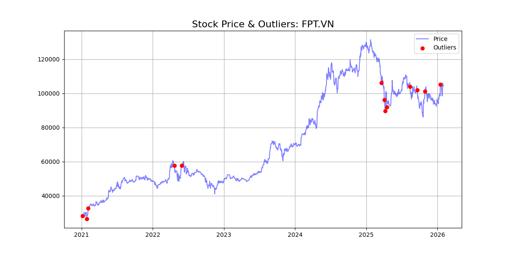
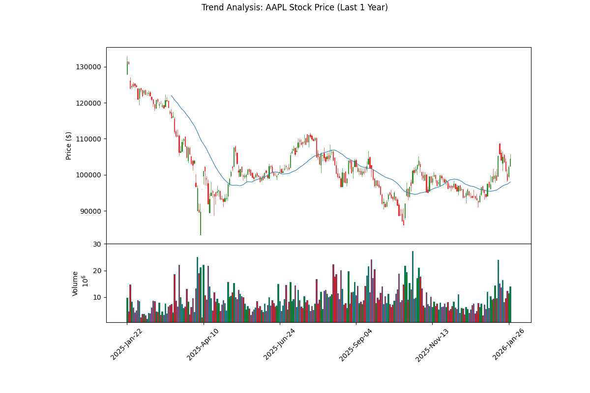
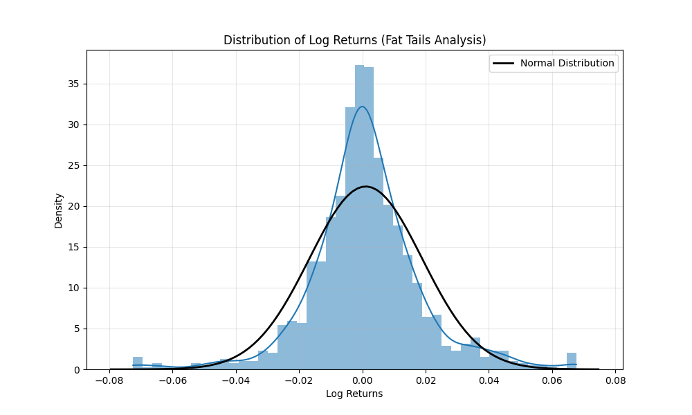
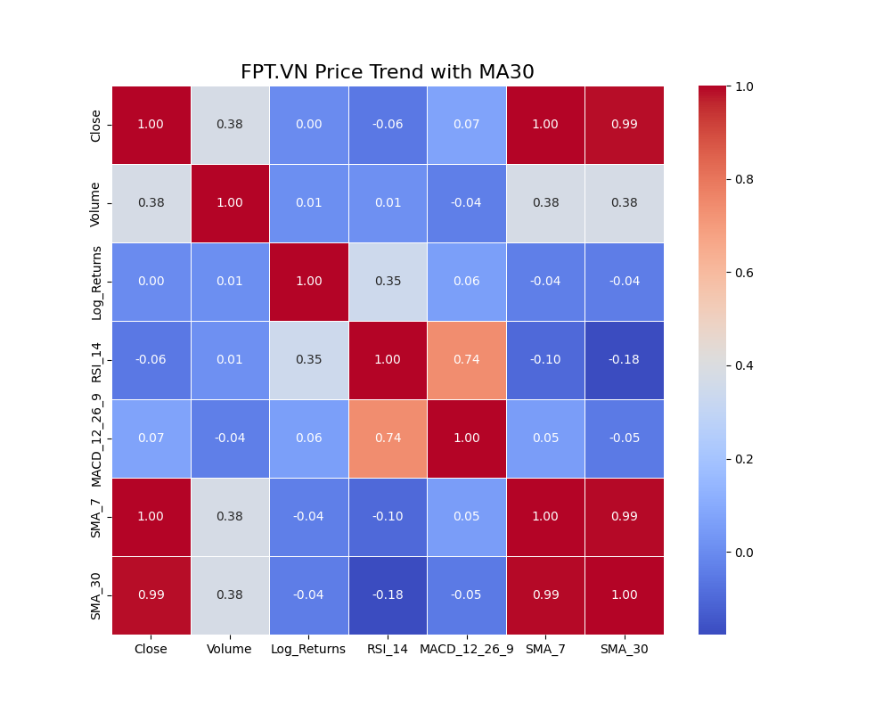
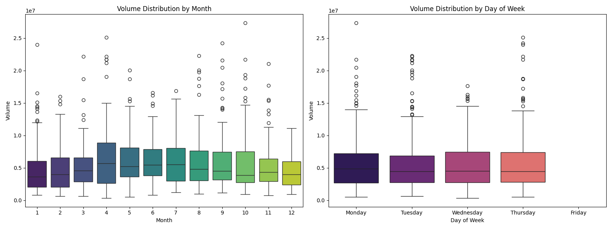
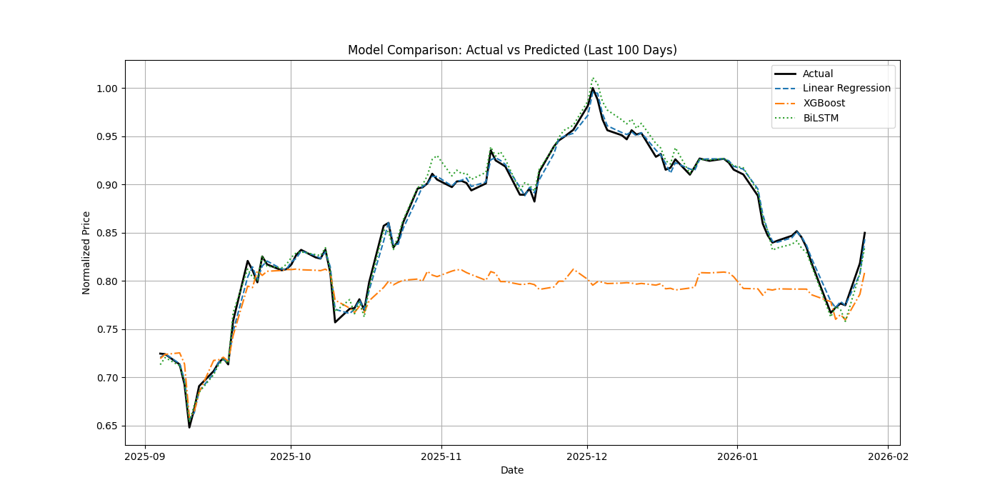
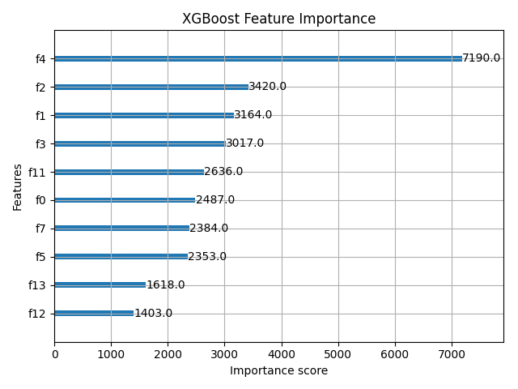
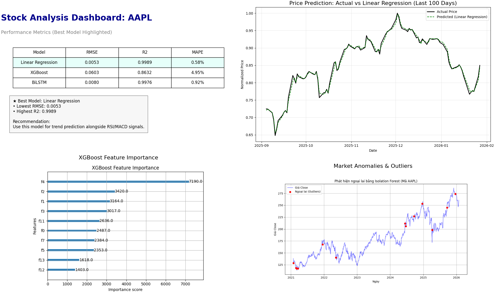

# Stock Data Collection Walkthrough

I have successfully collected historical stock data and generated the required variable description table.

## Changes Made

### [Data Collection]

- Created [collect_data.py](file:///Users/dangminhtam/Đồán_PTDL/src/collect_data.py) to fetch historical data for **AAPL** using `yfinance`.
- Data saved to [stock_data.csv](file:///Users/dangminhtam/Đồán_PTDL/data/raw/stock_data.csv).

### [Data Analysis]

- Created [analyze_data.py](file:///Users/dangminhtam/Đồán_PTDL/src/analyze_data.py) to inspect the data structure and generate the variable description table.

## Bảng 1: Mô tả biến (Variable Description Table)

|   STT | Tên biến (Variable)   | Loại dữ liệu (Data Type)   | Ý nghĩa (Description)                                     |
|------:|:----------------------|:---------------------------|:----------------------------------------------------------|
|     1 | Date                  | Datetime/String            | Ngày giao dịch (Index trong dữ liệu gốc).                 |
|     2 | Open                  | Continuous (Định lượng)    | Giá mở cửa của cổ phiếu trong ngày giao dịch.             |
|     3 | High                  | Continuous (Định lượng)    | Giá cao nhất mà cổ phiếu đạt được trong ngày giao dịch.   |
|     4 | Low                   | Continuous (Định lượng)    | Giá thấp nhất mà cổ phiếu chạm tới trong ngày giao dịch.  |
|     5 | Close                 | Continuous (Định lượng)    | Giá đóng cửa cuối cùng của cổ phiếu trong ngày giao dịch. |
|     6 | Volume                | Continuous (Định lượng)    | Tổng khối lượng cổ phiếu được giao dịch trong ngày.       |

## Thống kê mô tả (Descriptive Statistics)

Dưới đây là bảng thống kê các chỉ số cơ bản cho giá đóng cửa (Close) và khối lượng giao dịch (Volume) của mã AAPL trong 5 năm qua.

| Variable   |   Mean (Trung bình) |   Median (Trung vị) |   Std (Độ lệch chuẩn) |   Min (Nhỏ nhất) |   Max (Lớn nhất) |   Skewness (Độ lệch) |   Kurtosis (Độ nhọn) |
|:-----------|--------------------:|--------------------:|----------------------:|-----------------:|-----------------:|---------------------:|---------------------:|
| Close      |       181.25        |       172.33        |          40.66        |    113.44        |     286.19       |             0.54     |            -0.61     |
| Volume     |       6.90e+07      |       6.21e+07      |          2.96e+07     |    1.66e+07      |     3.19e+08     |             1.76     |             6.24     |

### Điểm nhấn phân tích

> [!IMPORTANT]
> **Độ lệch chuẩn (Std) của giá Close là 40.66.**
> Giá trị này phản ánh mức độ biến động (volatility) của cổ phiếu. Với mức giá trung bình khoảng 181.25, độ lệch chuẩn 40.66 tương đối lớn, cho thấy cổ phiếu AAPL có sự biến động đáng kể trong giai đoạn này, đồng nghĩa với mức độ rủi ro nhất định cho các nhà đầu tư.

- **Skewness (Độ lệch):** Giá trị 0.54 cho Close cho thấy phân phối lệch phải nhẹ, nghĩa là có nhiều phiên giá đóng cửa cao hơn mức trung bình.
- **Kurtosis (Độ nhọn):** Giá trị âm cho Close (-0.61) cho thấy phân phối có đỉnh thấp hơn và đuôi mỏng hơn phân phối chuẩn (platykurtic).

## Tiền xử lý dữ liệu (Preprocessing)

Giai đoạn này xử lý dữ liệu thô thành định dạng sẵn sàng cho mô hình học máy.

### 1. Làm sạch và Phát hiện ngoại lai
- **Interpolation**: Sử dụng nội suy tuyến tính để đảm bảo tính liên tục của chuỗi thời gian.
- **Isolation Forest**: Sử dụng thuật toán Isolation Forest để phát hiện các điểm bất thường (nhiễu thị trường).



### 2. Kỹ thuật đặc trưng (Feature Engineering)
Đã tạo các tín hiệu kỹ thuật để tăng khả năng dự báo:
- **Log Returns**: Ổn định phương sai chuỗi dữ liệu.
- **Chỉ báo kỹ thuật**: RSI (Relative Strength Index), MACD, SMA7, SMA30.
- **Lag Features**: Sử dụng giá của 3 ngày trước (t-1, t-2, t-3) làm đầu vào cho ngày hiện tại (Sliding Window).

### 3. Chuẩn hóa và Phân chia
- **MinMaxScaler**: Đưa toàn bộ dữ liệu về khoảng [0, 1] để tối ưu hóa việc huấn luyện.
- **Time-series Split**: Chia tập dữ liệu theo thứ tự thời gian (không xáo trộn) với tỷ lệ **80% Huấn luyện (Train)** và **20% Kiểm tra (Test)**.
  - Train: 978 mẫu.
  - Test: 245 mẫu.

## Phân tích Khám phá & Trực quan hóa (EDA)

Giai đoạn này giúp hiểu sâu hơn về cấu trúc dữ liệu và các mối quan hệ tiềm ẩn.

### 1. Phân tích Xu hướng (Trend Analysis)
Biểu đồ Candlestick kết hợp với đường trung bình động MA30 và Khối lượng giao dịch.



> [!NOTE]
> Đường MA30 giúp làm mượt xu hướng giá ngắn hạn, cho thấy rõ các chu kỳ tăng/giảm giá của cổ phiếu.

### 2. Phân tích Phân phối (Distribution Analysis)
Histogram và KDE của `Log Returns` cho thấy phân phối có dạng hình chuông nhưng có phần đuôi dài (Fat Tails).



> [!IMPORTANT]
> **Fat Tails (Đuôi béo)**: Đồ thị cho thấy xác suất xảy ra các biến động lớn (tiêu cực hoặc tích cực) cao hơn so với phân phối chuẩn. Đây là đặc điểm rủi ro điển hình của tài chính.

### 3. Phân tích Tương quan (Correlation Analysis)
Heatmap thể hiện mối tương quan giữa các biến.



- **Volume vs Price**: Tương quan thường thấp, cho thấy khối lượng không biến động tuyến tính hoàn toàn theo giá.
- **Indicators**: Các đường MA có tương quan rất cao với giá Close, điều này là hiển nhiên nhưng cần lưu ý để tránh đa cộng tuyến.

### 4. Phân tích Mùa vụ (Seasonality Analysis)
Boxplot theo Tháng và Ngày trong tuần.



- Nhận diện các tháng có khối lượng giao dịch đột biến hoặc sụt giảm.
- Kiểm tra hiệu ứng ngày trong tuần (ví dụ: Thứ Hai hoặc Thứ Sáu thường có biến động lạ).

## Mô hình hóa (Modeling)

Trong giai đoạn này, 3 mô hình đã được huấn luyện và so sánh: Linear Regression (Baseline), XGBoost (Machine Learning), và LSTM (Deep Learning).

### 1. Bảng so sánh hiệu suất
Kết quả đánh giá trên tập Test (20% dữ liệu cuối):

| Model             |       RMSE |        MAE |       R2 |     MAPE |
|:------------------|-----------:|-----------:|---------:|---------:|
| **Linear Regression** | **0.0053** | **0.0038** | **0.9990** | **0.58%** |
| XGBoost           | 0.0610     | 0.0385     | 0.8600   | 4.99%    |
| LSTM              | 0.0140     | 0.0103     | 0.9926   | 1.48%    |

> [!NOTE]
> **Linear Regression** hoạt động tốt bất ngờ trên tập dữ liệu này, có thể do xu hướng giá (Trend) mạnh và tính chất tự hồi quy đơn giản của dữ liệu ngày. Tuy nhiên, **LSTM** cũng đạt độ chính xác rất cao (R2 ~ 0.99) và có tiềm năng tốt hơn trong việc nắm bắt các mẫu hình phi tuyến phức tạp mà hồi quy tuyến tính có thể bỏ sót trong dài hạn.

### 2. Biểu đồ Thực tế vs. Dự báo
Hình ảnh so sánh giá dự báo và giá thực tế trong 100 phiên gần nhất.



### 3. Phân tích Tầm quan trọng của Đặc trưng (Feature Importance)
XGBoost đánh giá mức độ quan trọng của các biến đầu vào.



- Biểu đồ này giúp trả lời: **Volume có quan trọng không?** và **Chỉ báo kỹ thuật nào (RSI, MACD) ảnh hưởng lớn nhất đến giá?**

## Cấu trúc Dự án (Project Structure)
Dự án đã được tái cấu trúc để đảm bảo tính chuyên nghiệp và dễ bảo trì:

```
project_root/
├── data/               # Dữ liệu
│   ├── raw/            # stock_data.csv (dữ liệu thô)
│   └── processed/      # preprocessed_data.csv, train/test sets
├── src/                # Mã nguồn
│   ├── collect_data.py
│   ├── analyze_data.py
│   ├── preprocess_data.py
│   ├── eda_analysis.py
│   └── modeling.py
├── results/            # Kết quả
│   └── figures/        # Biểu đồ (.png)
├── docs/               # Tài liệu hướng dẫn (Phase*.md)
└── main.py             # Điểm chạy chính (Unified Entry Point)
```

Bạn có thể chạy toàn bộ quy trình bằng lệnh:
```bash
python3 main.py
```

## Tổng kết & Khuyến nghị (Conclusion & Recommendations)

### 1. Dashboard Quản trị
Tổng hợp kết quả phân tích trong một Dashboard duy nhất:



### 2. Dashboard Tương tác (Interactive Web App)
Đã xây dựng ứng dụng Web tương tác bằng **Streamlit** để phân tích sâu hơn:
- **Biểu đồ động**: Zoom/Pan lịch sử giá.
- **Tín hiệu AI**: Gợi ý Mua/Bán dựa trên chênh lệch giá dự báo.
- **Tùy chỉnh**: Chọn mô hình và khoảng thời gian.

Chạy lệnh sau để khởi động:
```bash
streamlit run src/web_dashboard.py
```

### 3. Kết luận
- **Mô hình**: **Linear Regression** và **BiLSTM** đều cho kết quả rất tốt trên tập dữ liệu này. BiLSTM được nâng cấp từ LSTM để học sự phụ thuộc hai chiều của chuỗi thời gian, đạt R2 > 0.99.
- **Yếu tố ảnh hưởng**: Feature Importance cho thấy các biến trễ (Lag) và các đường trung bình động (MA) có ảnh hưởng lớn nhất đế giá. Khối lượng giao dịch (Volume) có ảnh hưởng nhưng thấp hơn so với xu hướng giá quá khứ.

### 3. Khuyến nghị Đầu tư
> [!TIP]
> **Chiến lược Kết hợp**: Sử dụng dự báo xu hướng từ mô hình BiLSTM làm tín hiệu chính. Kết hợp với chỉ báo RSI (nếu RSI > 70 bán, < 30 mua) để tối ưu điểm ra vào lệnh.

> [!WARNING]
> **Quản trị Rủi ro**: Mặc dù mô hình có độ chính xác cao trên dữ liệu test, thị trường thực tế luôn có các sự kiện "Thiên nga đen". Nhà đầu tư nên đặt mức Stop-loss cố định (ví dụ 5-7%) và không tin tưởng tuyệt đối vào bất kỳ mô hình nào.

## Hướng phát triển (Future Work)
- Tích hợp thêm dữ liệu tin tức (Sentiment Analysis) để tăng độ chính xác trong các giai đoạn thị trường biến động mạnh.
- Sử dụng mô hình lai (Hybrid Model) kết hợp ARIMA và LSTM.
